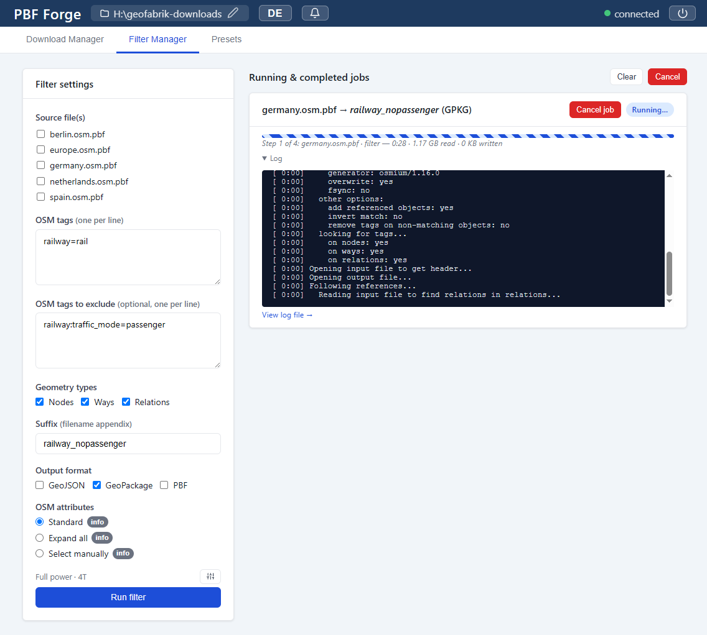

# PBF Forge

Download an OpenStreetMap PBF extract, filter it by tag, and get a GeoPackage, a GeoJSON or a smaller PBF back. Runs as one Docker container on your own machine.

[Quickstart](#quickstart) · [Your first filter](#your-first-filter) · [Limits](#limits) · [Alternatives](#alternatives) · [Documentation](#documentation)

[](https://github.com/MartinHoblisch/pbf-forge/actions/workflows/ci.yml)
[](https://github.com/MartinHoblisch/pbf-forge/actions/workflows/security.yml)
[](https://codecov.io/gh/MartinHoblisch/pbf-forge)
[](https://scorecard.dev/viewer/?uri=github.com/MartinHoblisch/pbf-forge)
[](https://github.com/MartinHoblisch/pbf-forge/releases/latest)
[](docs/install.md)
[](LICENSE)

## The problem

You want every rail line in Germany, or every charging station, as something QGIS can open. Overpass times out on that area. The osmium and GDAL route works, but it is four commands with flags you look up every time, and the one that matters, the tag expression, has a syntax you have to get exactly right before anything happens.

PBF Forge is that pipeline with a form in front of it. It downloads the extract, verifies its checksum, runs `osmium tags-filter`, converts the result with `ogr2ogr`, and writes a report next to every output listing the source, its OSM timestamp, the expressions used and the time each phase took. The tools underneath are the ones you would have called yourself, so the result is the same result.

It grew out of needing reproducible tag-filtered extracts for small GIS jobs often enough that assembling the pipeline by hand each time stopped being reasonable.



## Use this if

- You want country-sized or continent-sized extracts, where Overpass is the wrong tool.
- You want the same filter to be repeatable next month, with a record of what produced each file.
- You would rather click checkboxes than remember `--index-type=sparse_file_array`.
- You are handing the job to somebody who does not use a terminal.

## Do not use this if

- You need a live query against current OSM data. Extracts are snapshots, hours to days old.
- You need spatial predicates, a bounding box, or anything geometric. Filtering is by tag only.
- You want a hosted service. This runs on your machine, and only on your machine.
- You already know osmium and only ever run one filter. The container buys you nothing.

> [!NOTE]
> PBF Forge has no login, no API key and no user separation. It binds to `127.0.0.1` and is meant for one trusted person on their own machine. On Windows the folder picker can read every drive Docker Desktop can. Do not put it on a LAN or the internet. See [SECURITY.md](SECURITY.md).

## Quickstart

Needs Docker Desktop or Docker Engine 24 or newer. Works on Windows and Linux.

Linux and macOS:

```bash
git clone https://github.com/MartinHoblisch/pbf-forge.git
cd pbf-forge
./start.sh
```

Windows, in Command Prompt or PowerShell, or by double-clicking `start.bat`:

```
git clone https://github.com/MartinHoblisch/pbf-forge.git
cd pbf-forge
start.bat
```

Either way the browser opens at `http://localhost:8000` once the container is ready. The first start builds the image, which takes a few minutes. Stop with the Quit button in the header, or with `stop.sh` / `stop.bat`.

Use the launchers rather than `docker compose up`: they create the config file and the data directory that a bare compose run skips.

## Your first filter

One thing catches everybody once. **Type tag expressions without a `n/`, `w/` or `r/` prefix.** The tool builds that prefix from the Geometry types checkboxes and puts it in front of every expression, once per checked type. Pasting `w/highway=footway` with Ways checked produces `w/w/highway=footway`, which is valid, runs to completion, and matches nothing.

So, all footpaths in Liechtenstein:

1. Downloads tab. Paste the URL of the extract you want, for example `https://download.geofabrik.de/europe/liechtenstein-latest.osm.pbf`. Download it.
2. Filter tab. Source: the file from step 1.
3. Include tags, one per line:
   ```
   highway=footway,pedestrian,path,steps
   ```
4. Geometry types: Ways.
5. Output format: GeoPackage.

The result is one layer named after the output file, in EPSG:4326, next to a `.txt` report describing the run. [docs/filtering.md](docs/filtering.md) covers the expression syntax, the exclude pass and the three attribute modes.

## What it does

- **Downloads** any PBF URL you paste, whichever host it points at. Resumable, with a two-tier retry.
- **Verifies** every download against the `.md5` published beside it. A mismatch fails closed, and so does a missing checksum file. A PBF you copy into the data directory yourself is usable but has nothing to verify against.
- **Filters** by tag with `osmium tags-filter`, over the geometry types you check. A second tag set removes matches in an inverted pass.
- **Exports** GeoPackage, GeoJSON or the filtered PBF, with ODbL attribution and the full filter provenance embedded in the first two.
- **Reports** every run: source extract, its OSM timestamp, include and exclude tags, geometry types, attribute mode, per-phase timings.
- Queues jobs, survives its own crash, warns before a job that is likely to run out of memory, and speaks English and German.

## Numbers

One machine, one extract, two filters. The absolute times say more about the hardware than about the tool; the ratio between them is the part that transfers.

| | `amenity=charging_station`, Nodes | `railway=rail`, Ways and Relations |
|---|---|---|
| Runtime | 4m 45s | 17m 27s |
| Peak memory | 73 MiB | 2.01 GiB |
| Output | 14 MB, 43,252 features | 253 MB, 686,106 features |

Same 4.5 GB `germany.osm.pbf`, same machine (4 cores, container capped at 4 GB). A filter that has to resolve way and relation members costs roughly four times the time and thirty times the memory of one that only scans nodes. Extract size matters less than what you ask for.

## Limits

- **Tag only.** No bounding box, no polygon clip, no spatial predicate. Cut the area first with `osmium extract`, then filter here.
- **Your output will contain points you did not ask for.** `osmium tags-filter` keeps the nodes that a matched way refers to, and the export writes out every node carrying tags of its own. The `railway=rail` run above, with Nodes unchecked, produced 465,402 points against 220,696 lines: switches, signals and level crossings. Filter by geometry type after loading.
- **The exclude pass leaves the nodes behind.** Removing ways with `--invert-match` does not remove the nodes they used. In a PBF output those nodes stay, orphaned. In GeoPackage and GeoJSON the untagged ones are dropped during export, but tagged ones remain: measured on a Berlin extract, excluding 44% of the ways removed no points at all.
- **One layer per output file**, named after the file, holding whatever geometry types the filter produced.
- **No negation** inside an expression. Use the exclude field, which runs a second pass.
- **GeoJSON gets large.** Above a 200 MB source extract the interface says so and points at GeoPackage.
- **Snapshots, not live data.** However current the extract is, is how current your result is. The report states the timestamp.

## Alternatives

| | Reach for it when |
|---|---|
| [Overpass API](https://overpass-turbo.eu/) | The area is a city or smaller, you want current data, and you want the answer now. Not for country-scale extraction. |
| [osmium-tool](https://osmcode.org/osmium-tool/) | You are comfortable in a terminal and want the engine directly. PBF Forge calls it for you; it is not a replacement. |
| [QuickOSM](https://plugins.qgis.org/plugins/QuickOSM/) for QGIS | You are already in QGIS and the area is small. It queries Overpass, so it inherits Overpass's ceiling. |
| [osm2pgsql](https://osm2pgsql.org/) / [imposm](https://imposm.org/) | The destination is PostGIS and you want a maintained, updatable database rather than a file. |
| [Geofabrik custom extracts](https://www.geofabrik.de/data/extracts.html) | You want somebody else to cut it, by polygon, and you can pay for it. |

## New to OSM data?

An extract is a snapshot of the OSM database for one region, in the compact `.osm.pbf` format. Everything in it is a node, a way or a relation, and each carries tags such as `highway=footway`. Filtering means keeping the objects whose tags match.

The [OSM wiki on map features](https://wiki.openstreetmap.org/wiki/Map_features) lists which tags exist, and [taginfo](https://taginfo.openstreetmap.org/) shows how often each is actually used. Both are worth a look before you write a filter.

## Documentation

| | |
|---|---|
| [docs/install.md](docs/install.md) | First-time setup on Windows and Linux, data directory, resource limits |
| [docs/filtering.md](docs/filtering.md) | Expression syntax, the exclude pass, attribute modes, the report file |
| [docs/recipes.md](docs/recipes.md) | Worked examples with the settings that produce them |
| [docs/limits.md](docs/limits.md) | The limits above, with the reasoning |
| [docs/alternatives.md](docs/alternatives.md) | Longer comparison |
| [docs/tour.md](docs/tour.md) | More screenshots |
| [CHANGELOG.md](CHANGELOG.md) | What changed, per release |
| [docs/ROADMAP.md](docs/ROADMAP.md) | What is planned, and what is explicitly not |
| [CONTRIBUTING.md](CONTRIBUTING.md) · [DEVELOPMENT.md](DEVELOPMENT.md) · [SECURITY.md](SECURITY.md) | Contributing, development setup, security policy |

## Licensing and attribution

PBF Forge is MIT licensed. See [LICENSE](LICENSE).

The data is not. OpenStreetMap data is licensed under the [Open Database License 1.0](https://www.openstreetmap.org/copyright), which requires attribution and share-alike on derived databases. Every GeoPackage and GeoJSON written here carries `© OpenStreetMap contributors (ODbL 1.0).` in its metadata; keep it there in anything you pass on.

The terms of the host you download from apply on top, and they differ. The examples in this documentation point at Geofabrik, whose downloads are free for non-commercial use; commercial users should read <https://www.geofabrik.de/geofabrik/agb.html>. Point PBF Forge somewhere else and that host's terms apply instead.

## Acknowledgements

[osmium-tool](https://osmcode.org/osmium-tool/) does the filtering and [GDAL/OGR](https://gdal.org/) does the format conversion. This project is a form in front of them.

The map data comes from [OpenStreetMap contributors](https://www.openstreetmap.org/copyright). The extracts come from whichever host you point at; the examples here use [Geofabrik](https://www.geofabrik.de/), who publish extracts and their checksums for free.
