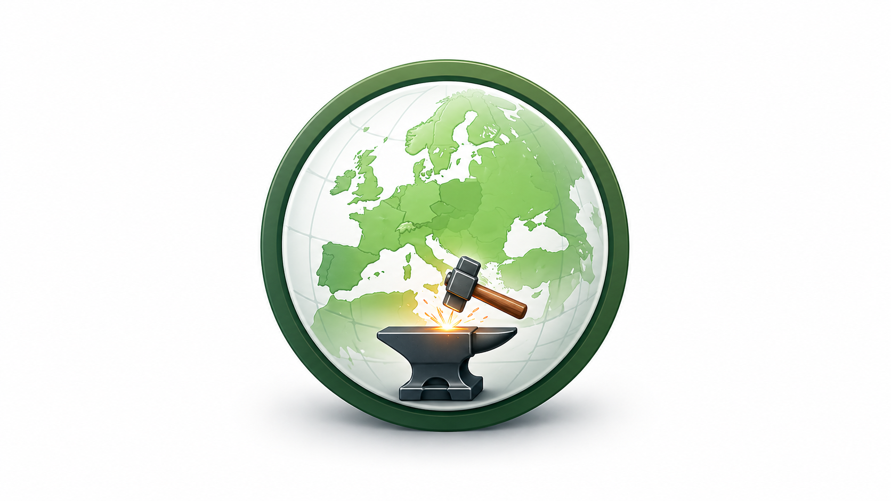
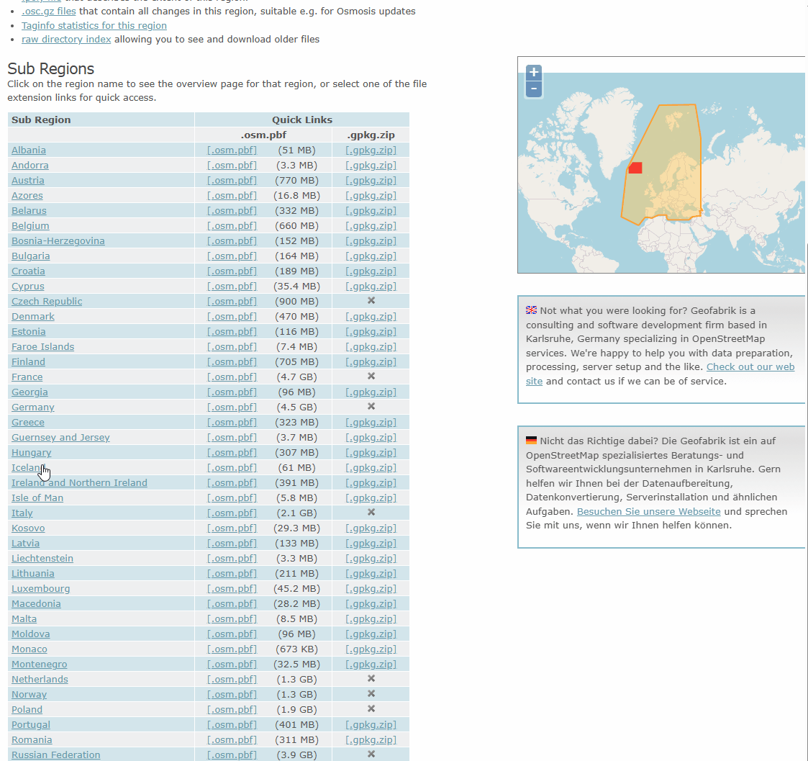

<p align="center">
  
</p>

# PBF Forge

Download an OpenStreetMap PBF extract, filter it by tag, and get a GeoPackage, a GeoJSON or a smaller PBF back. Runs as one Docker container on your own machine. Docker is all you need.

[](https://github.com/MartinHoblisch/pbf-forge/actions/workflows/ci.yml)
[](https://github.com/MartinHoblisch/pbf-forge/actions/workflows/security.yml)
[](https://codecov.io/gh/MartinHoblisch/pbf-forge)
[](https://scorecard.dev/viewer/?uri=github.com/MartinHoblisch/pbf-forge)
[](https://github.com/MartinHoblisch/pbf-forge/releases/latest)
[](docs/install.md)
[](LICENSE)

## The problem

You want every rail line in Germany, or every charging station, as something QGIS can open. Overpass times out on that area. The osmium and GDAL route works, but it takes four commands with flags you look up every time. The important one is the tag expression, and its syntax has to be exactly right or you get no result at all.

PBF Forge is that pipeline with a form in front of it. It downloads the extract, verifies its checksum, runs `osmium tags-filter`, converts the result with ogr2ogr, and writes a report next to every output listing the source, its OSM timestamp, the expressions used and the time each phase took. The tools underneath are the ones you would have called yourself, so the result is the same result.



## Quickstart

Needs Docker Desktop or Docker Engine 24 or newer. Works on Windows and Linux.

Linux:

```bash
git clone https://github.com/MartinHoblisch/pbf-forge.git
cd pbf-forge
./start.sh
```

Windows, in Command Prompt or PowerShell, or by double-clicking `start.bat`:

```
git clone https://github.com/MartinHoblisch/pbf-forge.git
cd pbf-forge
start.bat
```

Either way the browser opens at `http://localhost:8000` once the container is ready. The first start builds the image, which takes a few minutes. Stop with the Quit button in the header, or with `stop.sh` / `stop.bat`.

Prefer the launchers over `docker compose up`: they write the config file, create the data directory, apply the Windows drive mount, and wait for the server before opening the browser. It also works on its own. You then go through the first-run setup in the browser, and the data directory defaults to `./data`. [SECURITY.md](SECURITY.md) suggests that route if you would rather not give the container access to your drives.

## What it does

- **Downloads** any PBF URL you paste, whichever host it points at. Resumable, with a two-tier retry.
- **Verifies** every download against the `.md5` published beside it. If the checksum does not match, the download is rejected. A missing checksum file is rejected the same way. A PBF you copy into the data directory yourself is usable but has nothing to verify against.
- **Filters** by tag with `osmium tags-filter`, over the geometry types you check. A second tag set removes matches in an inverted pass.
- **Exports** GeoPackage, GeoJSON or the filtered PBF. The output holds your data and nothing else: no metadata is written into it. The report beside it records how it was produced.
- **Reports** every run: source extract, its OSM timestamp, include and exclude tags, geometry types, attribute mode, per-phase timings.
- Queues jobs, keeps the job history across a restart, and has an English and a German interface. A job that was running when the backend stopped is marked failed, not resumed.
- **Warns** before a filter whose sources are large relative to the memory the container may use, which is the cgroup limit rather than the host's total.

## Your first filter

One mistake is common. **Type tag expressions without a `n/`, `w/` or `r/` prefix.** The tool builds that prefix from the Geometry types checkboxes and puts it in front of every expression, once per checked type. Pasting `w/highway=footway` with Ways checked produces `w/w/highway=footway`, which is valid, runs to completion, and matches nothing at all.

So, all footpaths in Germany:

1. Downloads tab. Paste the URL of the extract you want, for example `https://download.geofabrik.de/europe/germany-latest.osm.pbf`. Download it. The file is about 4.5 GB, so the download takes a while; a smaller extract works exactly the same way if you would rather try it quickly.
2. Filter tab. Source: the file from step 1.
3. Include tags, one per line:
   ```
   highway=footway,pedestrian,path,steps
   ```
4. Geometry types: Ways.
5. Output format: GeoPackage.

The result is one layer named after the output file, in EPSG:4326, next to a plain-text report describing the run. [docs/filtering.md](docs/filtering.md) covers the expression syntax, the exclude pass and the three attribute modes.

## Limits

- **Tag only.** No bounding box, no polygon clip, no spatial predicate. Cut the area first with `osmium extract`, then filter here.
- **Your output will contain points you did not ask for.** `osmium tags-filter` keeps the nodes that a matched way refers to, and the export writes out every node carrying tags of its own. A `railway=rail` filter over Germany with Nodes unchecked produced 465,402 points and 220,696 lines. The extra points are switches, signals and level crossings. Filter by geometry type after loading.
- **The exclude pass leaves the nodes behind.** Removing ways with `--invert-match` does not remove the nodes they used. In a PBF output those nodes stay in the file, orphaned, with nothing referring to them. In GeoPackage and GeoJSON the untagged ones are dropped during export, but tagged ones remain: measured on a Berlin extract, excluding 44% of the ways removed no points at all.
- **One layer per output file**, named after the file, holding whatever geometry types the filter produced.
- **No negation** inside an expression. Use the exclude field, which runs a second pass.
- **GeoJSON gets large.** If the source extract is larger than 200 MB, the interface warns you and suggests GeoPackage.
- **Snapshots, not live data.** Your result is exactly as current as the extract you filtered. The report states the timestamp.

## Documentation

| Document | What is in it |
|---|---|
| [docs/install.md](docs/install.md) | First-time setup on Windows and Linux, data directory, resource limits |
| [docs/filtering.md](docs/filtering.md) | Expression syntax, the exclude pass, attribute modes, the report file |
| [docs/recipes.md](docs/recipes.md) | Worked examples with the settings that produce them |
| [docs/limits.md](docs/limits.md) | The limits above, with the reasoning |
| [docs/tour.md](docs/tour.md) | More screenshots |
| [CHANGELOG.md](CHANGELOG.md) | What changed, per release |
| [docs/ROADMAP.md](docs/ROADMAP.md) | What is planned, and what is explicitly not |
| [CONTRIBUTING.md](CONTRIBUTING.md) · [DEVELOPMENT.md](DEVELOPMENT.md) · [SECURITY.md](SECURITY.md) | Contributing, development setup, security policy |

## Licensing and attribution

PBF Forge is MIT licensed. See [LICENSE](LICENSE).

The data is not. OpenStreetMap data is licensed under the [Open Database License 1.0](https://www.openstreetmap.org/copyright), which requires attribution and share-alike on derived databases.

That obligation is yours, and it applies when you publish or hand on a result, not while you work with it locally. PBF Forge writes nothing into your output files, so add the notice yourself where your work is seen: "© OpenStreetMap contributors (ODbL 1.0)." The report beside every output names the source extract and its OSM timestamp if you need to trace where a file came from.

The terms of the host you download from apply on top, and they differ. The examples in this documentation point at Geofabrik, whose downloads are free for non-commercial use; commercial users should read <https://www.geofabrik.de/geofabrik/agb.html>. Point PBF Forge somewhere else and that host's terms apply instead.

## Acknowledgements

[osmium-tool](https://osmcode.org/osmium-tool/) does the filtering and [GDAL/OGR](https://gdal.org/) does the format conversion. This project is a form in front of them.

The map data comes from [OpenStreetMap contributors](https://www.openstreetmap.org/copyright). The extracts come from whichever host you point at; the examples here use [Geofabrik](https://www.geofabrik.de/), who publish extracts and their checksums for free.
