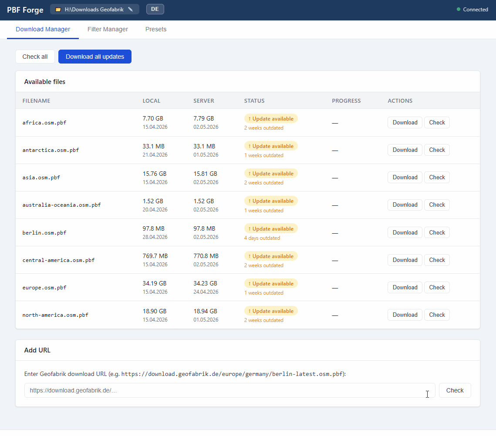
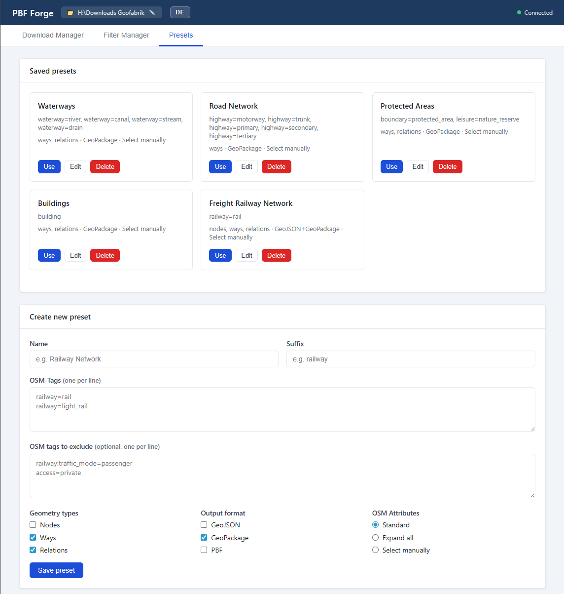
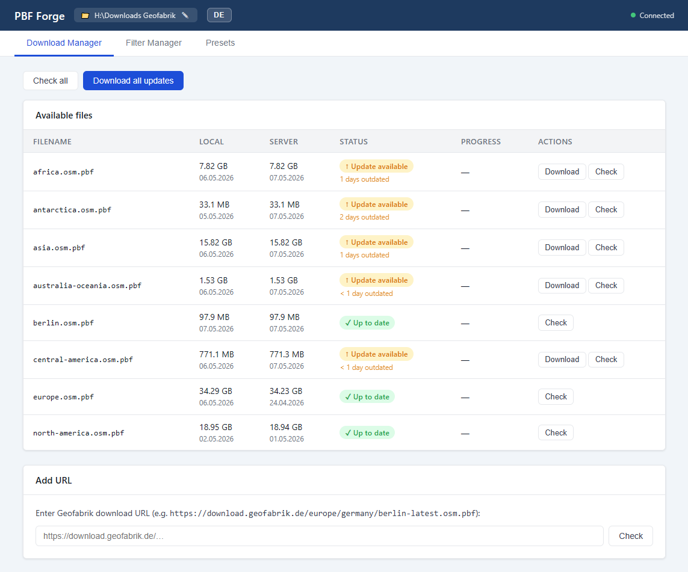

<div align="center">
  
</div>

# PBF Forge

> Self-hosted web UI for downloading OSM PBF extracts from Geofabrik and filtering them by tag. Docker-only. Exports GeoPackage, GeoJSON, GeoParquet.

[](LICENSE)
[](https://github.com/martinhoblisch/pbf-forge/actions/workflows/ci.yml)
[](CONTRIBUTING.md)

<p align="center">
  
</p>

<details>
<summary><strong>Screenshots</strong></summary>

<p align="center">
  
  
</p>
<p align="center">
  
</p>

</details>

---

## Quickstart

**Requires Docker Desktop or Docker Engine ≥ 24.**

```bash
git clone https://github.com/martinhoblisch/pbf-forge.git
cd pbf-forge
docker compose up
```

> **Linux only:** if you get `permission denied while trying to connect to the Docker daemon socket`, your user is not in the `docker` group yet. Run `sudo usermod -aG docker $USER`, then log out and back in (or run `newgrp docker` in the current shell). Then retry `docker compose up`.

Open <http://127.0.0.1:8000>. Choose a region, optionally apply a tag filter, export.

The container binds to `127.0.0.1` only and ships without authentication. **Do not expose it to a LAN or public internet.** See [SECURITY.md](SECURITY.md).

---

<details>
<summary><strong>Why I built this</strong></summary>

I needed reproducible OSM tag-filtered extracts for small GIS jobs and grew tired of stitching `wget` + `osmium tags-filter` + `ogr2ogr` shell pipelines for each request. PBF Forge wraps that pipeline in a browser UI so a non-CLI user can run the same workflow without memorising flags. It does not replace `osmium-tool` or QGIS — it removes friction for the narrow "download → filter → export" loop.

</details>

---

## Features

- **Geofabrik browser** — region tree (continents → countries → sub-regions), file size shown before download.
- **MD5 checksum verification** — every PBF is verified against Geofabrik's `<file>.osm.pbf.md5` before any filter step. Mismatch fails closed.
- **Tag filtering via `osmium tags-filter`** — full expression syntax (`n/`, `w/`, `r/`, `nwr/`, multi-tag, negation).
- **Filter history + named presets** — re-run last 50 filter expressions; save canned filters for reuse.
- **Export formats**
  - **GeoPackage** (`.gpkg`) — recommended. Multi-layer (`points`, `lines`, `multilinestrings`, `multipolygons`, `other_relations`), CRS EPSG:4326, embedded ODbL attribution + provenance metadata in `gpkg_metadata`.
  - **GeoParquet** (`.parquet`) — columnar, ideal for analytics workflows. CRS + attribution in the `geo` JSON metadata block.
  - **GeoJSON** (`.geojson`) — RFC 7946 (WGS84). A size guardrail warns when output would exceed 500 MB or 1 M features and steers you to GeoPackage or GeoParquet.
- **Live progress** — WebSocket streaming for download, checksum, filter, and export phases. Each long-running step is cancellable, with a size-based ETA hint (filtering a 30 GB Europe extract takes hours — the UI is honest about it).
- **Bilingual UI** — English and German.
- **Localhost-only by design** — no telemetry, no analytics, no update checks, no font/CDN fetches at runtime. The only outbound network traffic is to `download.geofabrik.de` for PBF and checksum files.

---

## Use-case examples

PBF Forge runs the same `osmium tags-filter` syntax you would type by hand. The expression goes into the **Filter** field; everything else is point-and-click. Three concrete scenarios:

### 1. Pedestrian-only routing graph for Liechtenstein

Goal: GeoPackage of footways and pedestrian areas only.

1. Region: **Europe → Liechtenstein** (`liechtenstein-latest.osm.pbf`, ~2 MB).
2. Filter expression:
   ```
   w/highway=footway,pedestrian,path,steps
   ```
3. Export: **GeoPackage**.

Output: ~5 k features, opens in QGIS as the `lines` layer with CRS EPSG:4326.

### 2. EV charging stations for an entire country

Goal: every `amenity=charging_station` node in Germany, as a single point layer for analytics.

1. Region: **Europe → Germany** (`germany-latest.osm.pbf`, ~4 GB).
2. Filter expression:
   ```
   n/amenity=charging_station
   ```
3. Export: **GeoParquet** (use Parquet, not GeoJSON — this would otherwise produce a multi-hundred-MB JSON file).

Output: a few tens of thousands of points with all `socket:*`, `capacity`, and `operator` tags preserved.

### 3. Cycling network with named relations for a federal state

Goal: bike routes plus their hierarchical relations for Bavaria.

1. Region: **Europe → Germany → Bavaria**.
2. Filter expression:
   ```
   nwr/route=bicycle nwr/network=lcn,rcn,ncn,icn
   ```
3. Export: **GeoPackage**.

Output: multi-layer GeoPackage where the `lines` and `other_relations` layers carry the route-segment geometries and the relation membership respectively.

---

## Roadmap

User-facing features under consideration are tracked in [docs/ROADMAP.md](docs/ROADMAP.md). Open an Issue or start a Discussion if a missing feature is blocking you.

---

## Privacy & commercial use

**Privacy.** PBF Forge does not collect telemetry, analytics, crash reports, or usage statistics. It does not phone home for update checks. The HTML/CSS/JS are served locally from the container — no Google Fonts, no CDN scripts, no third-party trackers. The only outbound network calls at runtime are to `download.geofabrik.de` for the PBF you requested and its `.md5` checksum file. Container logs (uvicorn access log, application stderr) stay inside the container; nothing is shipped off the host.

**Commercial use.** OpenStreetMap data is licensed under the [Open Database License (ODbL) 1.0](https://www.openstreetmap.org/copyright). PBF Forge embeds ODbL attribution in every GeoPackage, GeoParquet, and GeoJSON it produces — you must keep that attribution intact in any downstream product. **Geofabrik downloads themselves are free for non-commercial use; commercial users should review <https://www.geofabrik.de/geofabrik/agb.html> before deploying PBF Forge in a commercial workflow.**

---

## Acknowledgements

- **[Geofabrik GmbH](https://www.geofabrik.de/)** — free regional OSM PBF extracts and MD5 checksums.
- **[OpenStreetMap contributors](https://www.openstreetmap.org/copyright)** — the underlying map data, licensed under ODbL 1.0.
- **[osmium-tool](https://osmcode.org/osmium-tool/)** — the C++ engine that does the actual tag filtering.
- **[GDAL / OGR](https://gdal.org/)** — converts filtered PBF into GeoPackage, GeoParquet, and GeoJSON.
- **[FastAPI](https://fastapi.tiangolo.com/)** — backend framework.

---

## License

[MIT](LICENSE) © 2026 Martin Hoblisch.

OSM data is **not** MIT-licensed — it remains under [ODbL 1.0](https://www.openstreetmap.org/copyright). The MIT license covers PBF Forge's source code only.
